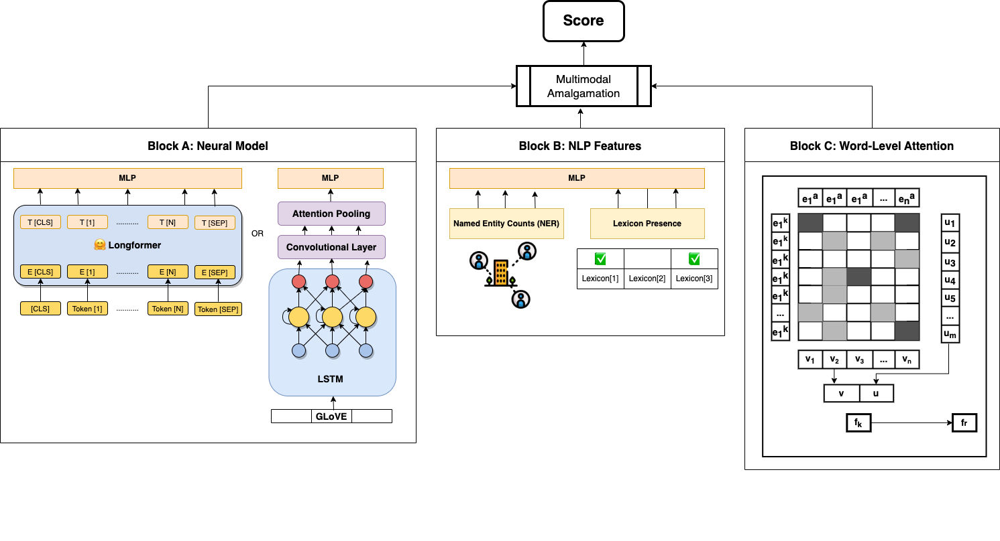

# A Generalisable Text Scoring Framework

<i>This is the official implementation of our paper in IEA AIE 2022. We have provided notebooks for benchmark evaluation of our scoring framework on ASAP-AES.</i>

Read the full paper [here](https://link.springer.com/chapter/10.1007/978-3-031-08530-7_58).


<p align="center"><i>Our hybrid proposal consists of blocks A, B and C.</i></p>

#### Block A (Neural Model)

Block A can either be (i) Non-hierarchical LSTM, (ii) Hierarchical LSTM or (iii) Longformer. (i) and (ii) are traditional RNNs, and (iii) is a transformer. We aim to choose the best of the three architectures.

1. <b>Non-hierarchical LSTM</b> - As the naive baseline, this model is based on the architecture of Taghipour. It consists of word tokenization, 300-dimensional pre-trained GLoVE embeddings, a convolutional layer for n-gram level feature extraction, an LSTM layer, pooling of LSTM states via mean-over-time or attention, followed by a 32-cell FCL, and another FCL with either a discrete softmax (classification) or scalar sigmoid (regression) activation. We replicate the same attention layer implementation of Taghipour, which involves the learning of an attention vector signifying the importance of each time step.

2. <b>Hierarchical LSTM</b> - While non-hierarchical LSTMs model text in a linear sequence, hierarchical LSTMs first split the text into sentences, and then words, resulting in a 3-dimensional input vector <i>(batch size, num sentences, num words)</i>. The word and sentence encoders can either be convolutions or LSTMs. Hence, our experiments test permutations of different encoders at both levels.

3. <b>Longformer</b> - To handle sequences of text longer than 512 words, we employ the Longformer model. By introducing a dilated sliding window and combining local and global attention, the Longformer can handle sequence lengths of up to 4096 words, pre-trained on autoregressive language modelling tasks. While the Longformer is not the state-of-the-art, we contend that it stands on the balance between fast computations and performance compared to RoBERTA and BigBird. Our longformer-based model consists of tokenization, Longformer block embeddings (finetuned), dropout and FCL.

#### Block B (NLP Features)

Block B is a module that processes the categorical presence of domain-specific lexicons and the numerical count of selected named entity families. This is based on the understanding that more detailed responses will make mention of relevant n-grams and named entities in their description. We use the Term Frequency-Inverse Document Frequency (TF-IDF) ranking of n-grams in the lemmatized corpus along with Spacy's rule-based PhraseMatcher to select and mark the 30 most meaningful lexicons, while using StanfordNLP's NER tagger to annotate the corpus before counting the frequency of each NER family (organisations, laws, persons) in each response. A Support Vector Classifier is used with Recursive Feature Elimination to identify handcrafted features that most impact the final score. The numerical features are transformed using a quantile normal distribution, and categorical features are one-hot encoded.

#### Block C (Rubric Word-level Attention)
Based on the work of Chen et al. and Wang et al., we compute the attentional similarity between expert-defined keywords (that one can expect a high-scoring response to use) and the response. The careful selection of phrases allows the injection of scoring rubrics into the model.

For a response r with n words and key phrase k with m words, GLoVE word embedding sequences:

$$
\{e_{1}^{r}, e_{2}^{r}, e_{3}^{r},...,e_{n}^{r} \}
$$ 

and 

$$
\{e_{1}^{k}, e_{2}^{k}, e_{3}^{k},...,e_{m}^{k} \}
$$ 

are respectively generated.

1. The dot product of the two sequences is computed.

$$
z_{i,j} = e_{i}^{k} \cdot e_{j}^{r}
$$

2. Softmax is computed over the rows and columns of the matrix to obtain $\alpha_{i}^{k}$ and $\alpha_{j}^{r}$, where $\alpha_{i}^{k}$ intuitively signifies the attention that the word $i$ in the key phrase pays to every word in $a$.

$$
\{\alpha_{i}^{k} = softmax(z_{i, 1}, ..., z_{i, n}), \ \alpha_{j}^{a} = softmax(z_{1, j}, ..., z_{m, j})\}
$$

3. Attentional vectors are computed based on $\alpha_{i}^{k}$ and $\alpha_{j}^{a}$ using a weighted sum for both key phrase to response and response to key phrase.


$$
\{u = \frac{1}{m} \sum \sum \alpha_{i,j}^{k} e_{j}^{r}, \ v = \frac{1}{n} \sum \sum \alpha_{j,i}^{r} e_{i}^{k}\}
$$

4. A feature vector $f_{k} = [u;v]$ is output for $k$ key elements before being concatenated into an overall word-level attention vector $f=[f_{1}, f_{2}, f_{3}, ... f_{k}]$.

#### Combining Module for Multimodal Amalgamation
The outputs of blocks B and C are combined with the logits output of the neural block either via an (a) attention sum or (b) an MLP. The attention sum adds the Longformer outputs, categorical and numerical features and the word-level attention feature vector, before the Longformer outputs query the result vector. For example, if $F$ is the final feature vector, $W$ is the weight matrix, $x$ is the longformer's text features, $c$ represents categorical features, $n$ represents numerical, and $w$ represents attentional features, the total features $F$ and attention $\alpha_{i,j}$ are:

$$
F=\alpha_{x,x}W_{x}x+\alpha_{x,c}W_{c}c+\alpha_{x,n}W_{n}n+\alpha_{x,w}W_{w}w
$$

$$
\alpha_{i,j} = \frac{exp(LeakyReLU(a^{T}[W_{i}x_{i}||W_{j}x_{j}]))}{\sum_{k\in\{x,c,n,w\}}exp(LeakyReLU(a^{T}[W_{i}x_{i}||W_{k}x_{k}]))}
$$

#### Acknowledgements
<i>We employed and built on top of Ken Gu's Pytorch implementation of multimodal transformers. Pretrained transformer weights are from Huggingface. The Pytorch implementation of word-level attention is based off Wang et al. (2019)'s Tensorflow implementation.</i>

If you have any queries, please contact us through this <a href="mailto:sidharrth2002@gmail.com">email</a>.

#### Citation

If you use our code, please cite this paper:

```bib
@inproceedings{10.1007/978-3-031-08530-7_58,
	title        = {Hybrid Deep Neural Networks for Industrial Text Scoring},
	author       = {Nagappan, Sidharrth and Goh, Hui-Ngo and Lim, Amy Hui-Lan},
	year         = 2022,
	booktitle    = {Advances and Trends in Artificial Intelligence. Theory and Practices in Artificial Intelligence},
	publisher    = {Springer International Publishing},
	address      = {Cham},
	pages        = {695--706},
	isbn         = {978-3-031-08530-7}
}
```

#### References

1. Beltagy, I., Peters, M.E., Cohan, A.: Longformer: The long-document transformer. CoRR abs/2004.05150 (2020)
2. Chen,Q.,Zhu,X.,Ling,Z.,Wei,S.,Jiang,H.:Enhancing and combining sequential and tree LSTM for natural language inference. CoRR abs/1609.06038 (2016)
3. Dasgupta, T., Naskar, A., Saha, R., Dey, L.: Augmenting textual qualitative fea-
tures in deep convolution recurrent neural network for automatic essay scoring. pp.
93–102 (2018)
4. Devlin, J., Chang, M., Lee, K., Toutanova, K.: BERT: pre-training of deep bidirec-
tional transformers for language understanding. CoRR abs/1810.04805 (2018)
5. Dong, F., Zhang, Y., Yang, J.: Attention-based recurrent convolutional neural net-
work for automatic essay scoring. pp. 153–162 (Aug 2017)
6. Gu, K., Budhkar, A.: A package for learning on tabular and text data with trans-
formers. In: Proceedings of the Third Workshop on Multimodal Artificial Intelli-
gence. pp. 69–73. Association for Computational Linguistics (Jun 2021)
7. Kumar, V., Boulanger, D.: Explainable automated essay scoring: Deep learning
really has pedagogical value. Frontiers in Education 5, 186 (2020)
8. Mayfield, E., Black, A.: Should you fine-tune bert for automated essay scoring?
pp. 151–162 (01 2020)
9. OECD: Who are the owners of the world’s listed companies and why should we care?, https://www.oecd.org/corporate/who-are-the-owners-of-the-worlds-listed-companies-and-why-should-we-care.htm
10. Page, E.B.: Project essay grade: Peg. Journal of Educational Technology (2003)
11. Pennington, J., Socher, R., Manning, C.: GloVe: Global vectors for word represen- tation. In: Proceedings of the 2014 Conference on Empirical Methods in Natural Language Processing (EMNLP). pp. 1532–1543. Association for Computational
Linguistics (Oct 2014). https://doi.org/10.3115/v1/D14-1162
12. Riordan, B., Horbach, A., Cahill, A., Zesch, T., Lee, C.M.: Investigating neural architectures for short answer scoring. pp. 159–168. Association for Computational Linguistics (Sep 2017)
13. Shermis, M.D., Burstein, J.: Automated essay scoring : A cross-disciplinary perspective. In: Proceedings of the 2003 International Conference on Computational
Linguistics. p. 13 (2003)
14. Taghipour, K., Ng, H.T.: A neural approach to automated essay scoring. In: Proceedings of the 2016 Conference on Empirical Methods in Natural Language Pro-
cessing. pp. 1882–1891. Association for Computational Linguistics (11 2016)
15. Uto, M., Xie, Y., Ueno, M.: Neural automated essay scoring incorporating hand- crafted features. In: Proceedings of the 28th International Conference on Computational Linguistics. pp. 6077–6088. International Committee on Computational Linguistics (Dec 2020)
16. Wang, T., Inoue, N., Ouchi, H., Mizumoto, T., Inui, K.: Inject rubrics into short answer grading system. In: Proceedings of the 2nd Workshop on Deep Learning
Approaches for Low-Resource NLP. pp. 175–182 (2019)
17. Yang, Z., Yang, D., Dyer, C., He, X., Smola, A., Hovy, E.: Hierarchical attention networks for document classification. pp. 1480–1489. Association for Computational Linguistics (Jun 2016)
18. Zaheer,M.,Guruganesh,G.,Dubey,A.,Ainslie,J.,Alberti,C.,Ontañón,S.,Pham,
P., Ravula, A., Wang, Q., Yang, L., Ahmed, A.: Big bird: Transformers for longer sequences. CoRR abs/2007.14062 (2020), https://arxiv.org/abs/2007.14062
